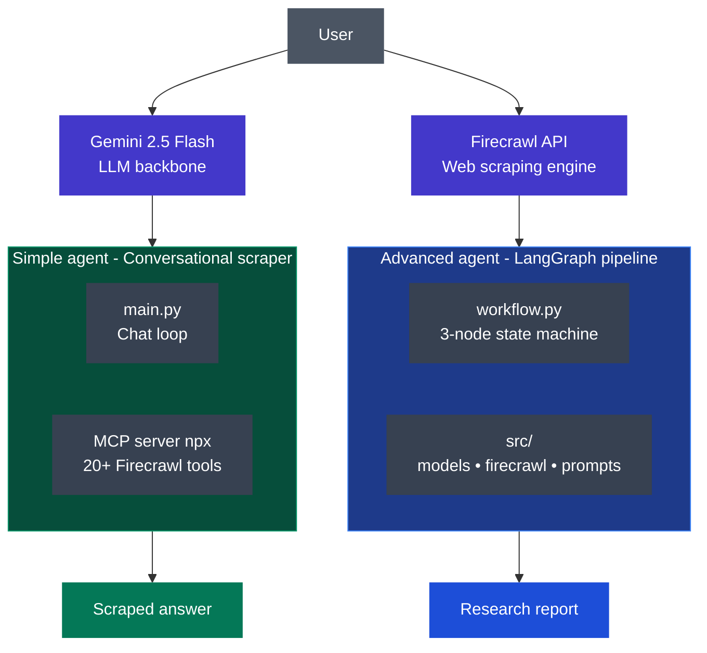
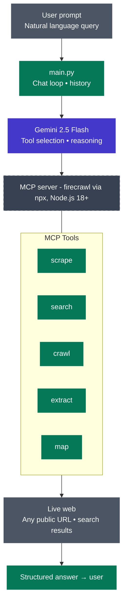
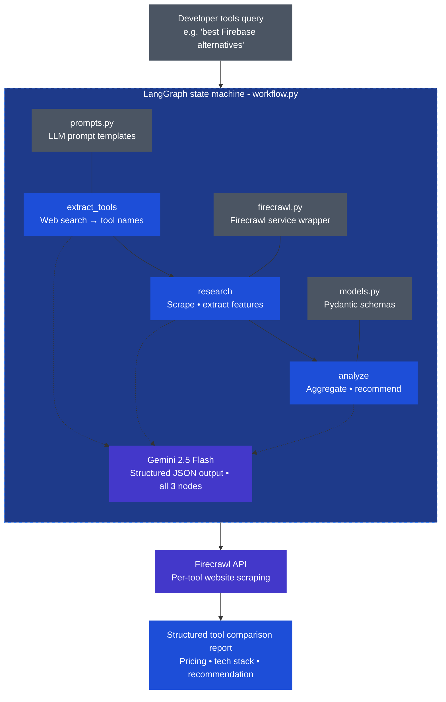

# 🤖 SentinelAI Agent

<div align="center">


**A powerful dual-agent AI system powered by Google Gemini 2.5 Flash, LangGraph, and Firecrawl — built for real-time web research and intelligent developer tool analysis.**

[Features](#-features) • [Quick Start](#-quick-start) • [Simple Agent](#-simple-agent) • [Advanced Agent](#-advanced-agent) • [Architecture](#-architecture) • [Tech Stack](#-tech-stack)

</div>

---

## ✨ Features

- 🔍 **Real-time Web Scraping** — Scrape any website and extract structured data on demand
- 🤖 **Dual Agent System** — Choose between a conversational agent and a multi-step research agent
- 🧠 **Powered by Gemini 2.5 Flash** — Google's latest and most capable AI model
- 🌐 **Firecrawl Integration** — Enterprise-grade web crawling via MCP (Model Context Protocol)
- 🔄 **LangGraph Workflows** — Structured multi-step agentic pipelines with state management
- 📊 **Developer Tools Research** — Automatically researches, compares, and recommends dev tools
- 🏗️ **Pydantic Data Models** — Strongly typed structured output for reliable data extraction
- 💬 **Interactive Chat Loop** — Persistent conversation history with context retention

---

## 📁 Project Structure

```
SentinelAI-Agent/
│
├── 📂 simple-agent/               # Conversational web scraping agent
│   ├── main.py                    # Entry point & chat loop
│   ├── .env                       # API keys
│   └── pyproject.toml             # Dependencies
│
├── 📂 advanced-agent/             # Multi-step developer tools researcher
│   ├── main.py                    # Entry point & results display
│   ├── .env                       # API keys
│   ├── pyproject.toml             # Dependencies
│   └── 📂 src/
│       ├── workflow.py            # LangGraph multi-step pipeline
│       ├── models.py              # Pydantic data models
│       ├── firecrawl.py           # Firecrawl service wrapper
│       └── prompts.py             # LLM prompt templates
│
└── README.md
```

---

## 🚀 Quick Start

### Prerequisites

Make sure you have the following installed:

- **Python 3.12+**
- **Node.js 18+** (required for the Simple Agent's MCP server)
- **pip** (Python package manager)

### Get Your API Keys

You will need two API keys:

| Service | Where to get it | Used For |
|---|---|---|
| **Gemini API Key** | [Google AI Studio](https://aistudio.google.com/app/apikey) | Powers the AI brain |
| **Firecrawl API Key** | [Firecrawl.dev](https://firecrawl.dev) | Powers web scraping |

---

## 🤖 Simple Agent

A conversational AI agent that can scrape websites, search the web, and extract data — all through natural language chat.

### Setup

```bash
cd simple-agent
```

Create your `.env` file:
```env
GEMINI_API_KEY=your_gemini_api_key_here
FIRECRAWL_API_KEY=your_firecrawl_api_key_here
```

Install dependencies:
```bash
pip install -e .
```

### Run

```bash
python main.py
```

### Example Prompts

Once you see the `You:` prompt, try:

```
Can you scrape https://supabase.com and tell me what they do?
```
```
Search the web for the latest pricing plans of Vercel and extract the details.
```
```
Find the top 5 Python web frameworks in 2025 and compare them.
```

Type `quit` to exit.

### How It Works

```
User Input → Gemini 2.5 Flash → Selects Firecrawl Tool → Scrapes Web → Returns Answer
```

The Simple Agent connects to a **Firecrawl MCP server** via `npx`, giving Gemini access to 20+ real-time web tools including:

| Tool | Description |
|------|-------------|
| `firecrawl_scrape` | Scrape a single URL |
| `firecrawl_search` | Search the web |
| `firecrawl_crawl` | Crawl entire websites |
| `firecrawl_extract` | Extract structured data |
| `firecrawl_map` | Map all URLs on a site |

---

## 🔬 Advanced Agent

A multi-step **LangGraph workflow** that researches developer tools, analyzes pricing and tech stacks, and generates expert recommendations.

### Setup

```bash
cd advanced-agent
```

Create your `.env` file:
```env
GEMINI_API_KEY=your_gemini_api_key_here
FIRECRAWL_API_KEY=your_firecrawl_api_key_here
```

Install dependencies:
```bash
pip install -e .
```

### Run

```bash
python main.py
```

### Example Queries

Once you see the `🔍 Developer Tools Query:` prompt, try:

```
What are the best open-source alternatives to Firebase for a Next.js app?
```
```
Compare Vercel and Netlify for deploying React applications.
```
```
What are the top ORM tools for Python developers?
```
```
Find the best vector databases for building AI applications.
```

Type `quit` to exit.

### How It Works

The Advanced Agent runs a **3-step LangGraph pipeline**:

```
Step 1: Extract Tools
  └── Searches the web for articles about the query
  └── Uses Gemini to extract relevant tool names

Step 2: Research Each Tool
  └── Searches for each tool's official website
  └── Scrapes pricing, features, and tech details
  └── Analyzes content with Gemini (structured output)

Step 3: Generate Recommendations
  └── Aggregates all research
  └── Generates a concise expert recommendation
  └── Returns final structured report
```

### Output Format

For each tool found, the agent outputs:

```
1. 🏢 Supabase
   🌐 Website: https://supabase.com
   💰 Pricing: Freemium
   📖 Open Source: True
   🛠️  Tech Stack: PostgreSQL, GoTrue, Realtime, Storage
   💻 Language Support: JavaScript, Python, Dart, Swift, Kotlin
   🔌 API: ✅ Available
   🔗 Integrations: GitHub, Vercel, Netlify, AWS
   📝 Description: Open-source Firebase alternative built on PostgreSQL

Developer Recommendations:
----------------------------------------
Supabase is the best choice for open-source Firebase alternatives...
```

---

## 🏗️ Architecture

### High-Level System Architecture


### Simple Agent Data Flow


### Advanced Agent LangGraph Pipeline


---

## 🛠️ Tech Stack

| Technology | Purpose | Version |
|---|---|---|
| **Python** | Core language | 3.14 |
| **Google Gemini 2.5 Flash** | AI / LLM backbone | Latest |
| **LangChain** | LLM framework & tooling | ≥1.3.4 |
| **LangGraph** | Agentic workflow state machine | ≥1.2.4 |
| **Firecrawl** | Web scraping & crawling | ≥4.28.2 |
| **MCP (Model Context Protocol)** | Tool server for Simple Agent | ≥1.0.0 |
| **Pydantic** | Data validation & structured output | ≥2.13.4 |
| **python-dotenv** | Environment variable management | ≥1.0.0 |

---


##  Acknowledgements

- [Google AI Studio](https://aistudio.google.com) — for providing Gemini API access
- [Firecrawl](https://firecrawl.dev) — for the best-in-class web scraping API
- [LangChain](https://langchain.com) — for the LLM framework
- [LangGraph](https://langchain-ai.github.io/langgraph/) — for the agentic workflow system

---

<div align="center">

**Create by [Sihan Udayaratna](https://github.com/SihanUdayaratna03)**


</div>
